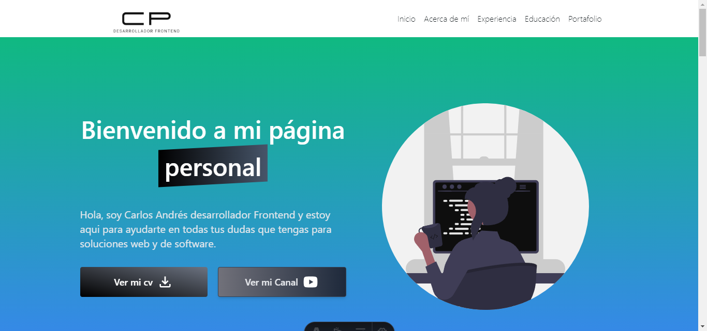

# Hoja de Vida Carlos Andrés Puello

Fue creada con Astro para el uso de mi portafolio personal aqui puede destacar todo sobre mi CV el cuál contiene:

-Inicio
-Acerca de mí
-Experiencia
-Educación
-Portafolio

-Inicio: Muestra info de mí y mi CV y mi Canal de Youtube.

-Acerca de mí: Más info de mi persona y mis redes sociales y caracteristicas como persona y como profesional.

-Experiencia: Se muestra las distintas empresas donde he laborado.

-Educación: Se agrega los distintos grados educativos desde el bachillerato hasta postgrado.

-Portafolio: Muestra el desarrollo personal que se ha hecho y que tecnologias se ha usado al respecto.
